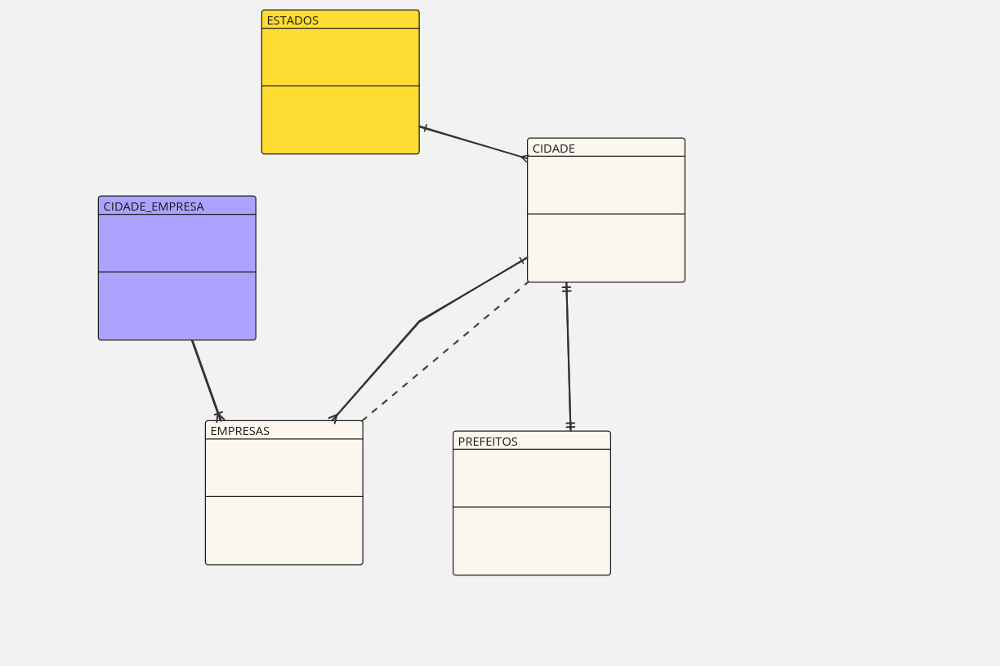

# 💡 Repositório de Estudos em SQL

Aqui você encontra exemplos práticos, explicados passo a passo, para te ajudar a aprender SQL de forma simples e aplicada.

## 📘 O que você vai encontrar:
- Comandos básicos (`SELECT`, `WHERE`, `ORDER BY`, etc);
- Tópicos intermediários (`GROUP BY`, `JOIN`, `CASE WHEN`);
- Explicações e instruções;
- Modelos de tabela para simular os dados;

## 📂 Estrutura
- 📂Conceitos-Importantes → Conceitos importantes e algumas anotações referentes à linguagem SQL;
- 📂schema → Estruturação de arquivos para criação e manipulação do schema de estudos;

## 🚀 Possibildades:
1. Copiar e colar os códigos no seu banco local, recomendo MySQL.
2. Explorar os comentários explicativos em cada arquivo `.sql`.

## 🧠 Diagrama UML do Schema criado:

## ✍️ Licença
Este repositório é livre para uso educacional. Pode clonar, adaptar e compartilhar.

---
📌 Me siga no LinkedIn para mais conteúdos: [Hudson Teles](https://www.linkedin.com/in/hudson-teles-381a451ab/)
